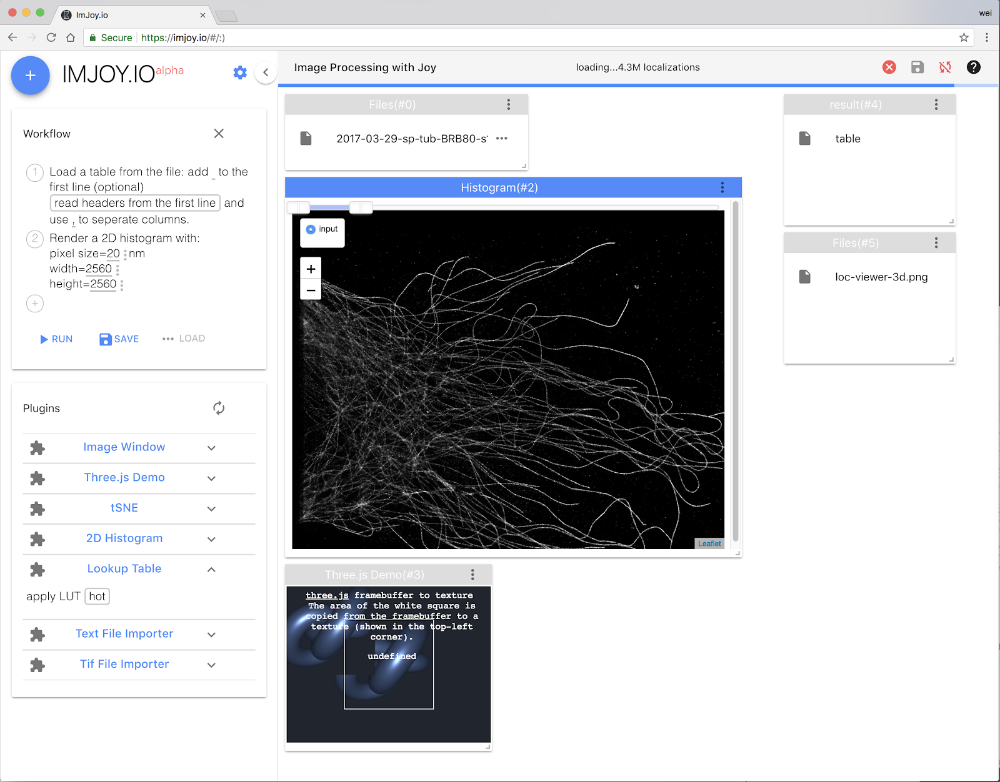

# Overview

ImJoy is a flexible image processing framework allowing the deployment of complex
computational tasks in a robust, secure and easy-to-use environment. The entire functionality is provided by **plugins**. Within a modern graphical user-interface, these plugins can be assembled into **workflows**. This design makes ImJoy intuitive to work with for end users. Plugins can be grouped and installed into isolated workspaces, this essentially avoids overcrowded plugin menu.

</img>

Imjoy consists of **two parts**:
1. the **user interface**
2. the **computational backend**

While ImJoy web app alone can perform computational tasks with the powerful Javascript engine and WebGL which provides GPU access, adding an additional computational backend allows ImJoy to access the entire Python ecosystem.

By design, ImJoy itself provides very minimal task specific functionality, it provides a flexible plugin interface to support plugins for extending the user interface and performing compuational tasks. Plugins can be designed for performing  simple tasks such as reading tif file, or more complex tasks such as training a deep learning model for image segmentation.

</img>

## Key features
 * Minimal and flexible design
 * Rich and interactive user interface powered by web technologies
 * Powerful computational backend powered by the Python ecosystem
 * Easy-to-use workflow composition
 * Isolated workspaces for grouping plugins 
 * Extendable plugin interface supports Python and Javascript
 * Concurrent plugin execution through asynchronous programming
 * Self-contained plugin development
 * Easy plugin deployment and sharing through Github or Gist

## Source code

Currently, ImJoy source code consists of three repositories:
 * [web application](https://github.com/oeway/ImJoy/)
 * [plugin engine](https://github.com/oeway/ImJoy-Python)
 * [plugin repository](https://github.com/oeway/ImJoy-Plugins)

## Acknowledgements

This is a non-exhaustive list of the open-source tools and libraries we used in ImJoy:
 * [Vue.js](https://vuejs.org/)
 * [Jailed](https://github.com/asvd/jailed)
 * [Joy.js](https://github.com/ncase/joy)
 * [conda](https://conda.io/)
 * [python-socketio](https://github.com/miguelgrinberg/python-socketio)

We thank all the authors for offering these excellent work to the open-source community.

## License

[MIT License](https://github.com/oeway/ImJoy/blob/master/LICENSE)

