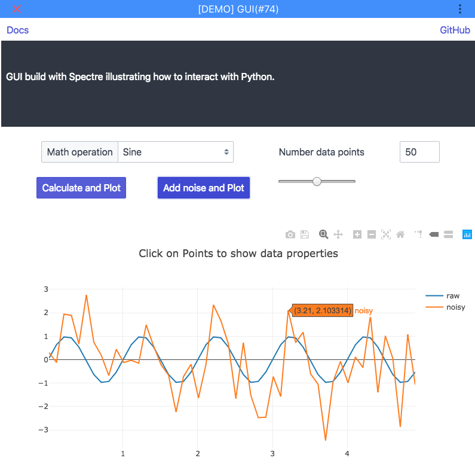
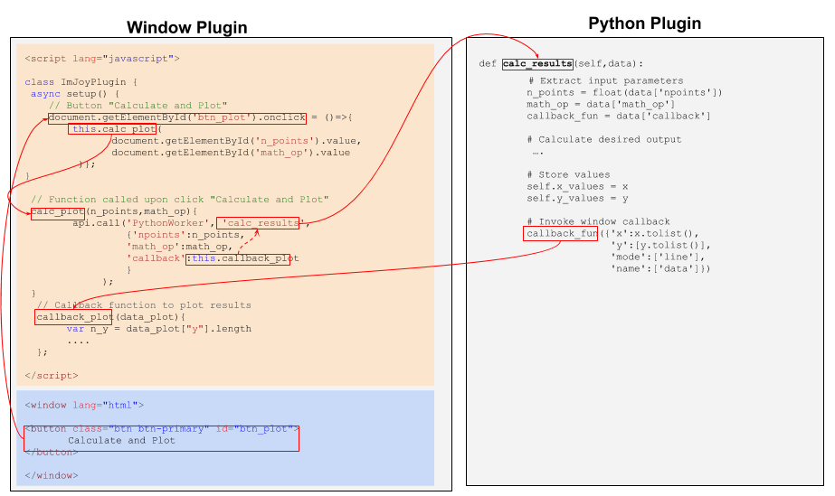

# Tutorials
Here we provide several tutorial illustrating important concepts of ImJoy. 

## User interaction
An important part of ImJoy is to provide a flexible way to interact with the user, to either specify input information or provide results. 

**User input**

1. In the simplest case, you can define how the GUI of the plugin is rendered in the plugin dialog. You can ask for general user-input in the [**`<config>` block**](https://imjoy.io/docs/#/development?id=ltconfiggt-block) or specify specific input for the different [**plugin operations**](https://imjoy.io/docs/#/api?id=api-register-).
2. The ImJoy API provides several functions to ask for user input, e.g. [file dialog](https://imjoy.io/docs/#/api?id=api-showfiledialog-), or a [general dialog](https://imjoy.io/docs/#/api?id=api-showdialog-).

**Provide results**

1. The ImJoy API provides several functions to show results, e.g. indicate [progress](https://imjoy.io/docs/#/api?id=api-showprogress-), update the [ImJoy status](https://imjoy.io/docs/#/api?id=api-showstatus-), 
2. The ImJoy API also provides a function to [create a window](https://imjoy.io/docs/#/api?id=api-createwindow-). In this window, powerful JavaScript visualization librariers can used. For more details, have a look at our window plugin demo **ADD LINK**.

**Dedicate user interface**
For more advanced purposes, you can can use define a user interface with the [**window plugin**](https://imjoy.io/docs/#/development?id=ltconfiggt-block). Such an interface is designed with web technology (HTML, JavaScript and CSS) and thus provides maximum flexibility. Further, such an interface can communicate with another plugin, e.g. a Python worker that performs the actual analysis. For more details, have a look at the dedicated tutorial below. **ADD LINK**.

### Python worker plots to window
**TO BE ADDED**

### User interface communicating with Python worker
In this tutorial, we show how to use a **window** plugin to defined a user interface, and how this interface can interact with a **Python worker** plugin to perform calculations. You can install this plugin from this [**ADD**](). This will install the actual interface plugin (called **ADD**) and the Python plugin (**ADD**) performing the calculations. The purpose of this plugin is self-explanatory, so just play around. 

</img>

This tutorial illustrates a number of different important concepts, which we describe briefly below.

1. How to get started in coding an ImJoy user-interface with HTML and JavaScript.
2. How to communicate between the user interface and the Python worker.
3. How to store data in the Python worker for further calcuations. 

#### Web-design for an ImJoy user interface
The window plugins are developed with HTML5/CSS and JavaScript. Here we provide only a fast overview of these languages. 
Excellent ressources to get started with HTML and JavaScript

* Hands-on tutorial can be found here [www.w3schools.com/](https://www.w3schools.com/)
* Different online coding platforms exist to test and develop code, but you can essentially use ImJoy to test your code. 
Useful platforms are
    * [https://playcode.io/](https://playcode.io/)
    * [https://codepen.io](https://codepen.io/) 

HTML5/CSS and JavaScript control the three relevant aspects of an interface. In ImJoy, these three elements are defined in one [single file **ADD**](), and specified in dedicated code blocks.

* **HTML**: structure.  The HTML code is in the code block delignated with 
    ```
    <window lang="html">
       ...
    </window>
    ```
* **JavaScript**: behavior of the interface
    ```
    <script lang="javascript">
       ...
    </window>
    ```

* **CSS**: visual appearance of the interface. Here, we we recommend [Spectre.css](https://picturepan2.github.io/spectre/), an easy to use framework to design webinterfaces. This framework can be imported in the plugin requirements
    ```
   "requirements": ["https://unpkg.com/spectre.css/dist/spectre.min.css",
                   "https://unpkg.com/spectre.css/dist/spectre-exp.min.css",
                   "https://unpkg.com/spectre.css/dist/spectre-icons.min.css"],
    ```
##### Processing user input and calling Python function 
The image below shows some code snippets to illustrate how user interput is retrieved, and a Python function called. The following sequence is shown.

1. User presses on a button to perform a calculation based on some defined input. 
2. Python function is called.
3. Calculations are performed, results stored in Python plugin and shown in main interface.

</img>

**Determine behavior of HTML elements**

Different **HTML elements respond to user interaction**. The corresponding action is defined in JavaScript in the ```setup()``` function. In the image above, this is shown for the html element button with the id `btn_plot`. When the user clicks on this button (`onclick`) the defined function call is called. In the example, the current value of two other html elments (the forms containing the number of data points and the math operator) are retrieved, and passed to another function called `calc_plot()`.

**Communication between window and Python plugin**
Communication between the window and Python plugin is achieved by the ImJoy API [**api.call()**](https://imjoy.io/docs/#/api?id=api-call-) and so-called **callback functions**. Simply put such a callback is a function that will be executed after another function has finished its execution. The function `calc_plot()` from above will use `api.call()` to call the function `calc_results` from the `Python worker` plugin. It will pass two parameters obtained from the user-interface and a callback function . The callback function allows the Python plugin to plot data in the window plugin.

**Python calculations, storage and callback**
Let's have a look at the Python function `calc_results`. It receives the JavaScript dictionary, extracts all necessary parameters and perform the desired calculation. Then it stores the data wiht `self.x_values = x`. Lastly, invokes the callback function to print in the main window with `callback_fun(...)`. Here the parameters are again passed as a dictionary. Please note, the **numpy** arrays are not supported, and the data has therefore be transformed to a list. 

## Distribution and deployment

### Distribution and deployment of a plugin with GitHub Gist

We assume that the entire code is contained in the plugin file and no extra
dependencies are required. [GitHub Gist](https://gist.github.com/) is a service provided by GitHub  to easily share individual files. Every gist is a GIT repository, so it provides version control, it can be forked and cloned.

##### Deploy your ImJoy Plugin to Gist

1. Go to gist on your GitHub account [https://gist.github.com/](https://gist.github.com/)
1. Create new gist and copy & paste the code of your plugin.
1. Give a new name followed by  `.imjoy.html`
1. Create either public or secret gist.
1. Link to gist can be obtained from the 'Raw' button (this links to the unprocessed versions of the file). Please note that this url
will change when you update your file.

##### Distribute plugin with url
Once your plugin is on gist, you can distribute it with a single link. When pressing this link, ImJoy will open its Plugin import interface, where the user has to confirm the installation of the plugin. 
`http://imjoy.io/#/app?plugin=LinkToGIST.imjoy.html`

You can also control where the plugin will be installed by setting the
workspace parameter `w=`:
`http://imjoy.io/#/app?w=PluginTest&plugin=LinkToGIST.imjoy.html`

Alternatively, this url can then be used to install the plugin directly in ImJoy: press the `+ Plugins` button and add the the url in the field `Install plugin from url`. 

### Distribution and deployment of code/data stored on Dropbox
This example describes how you can distribute and deploy a Python plugin
with code or data that is stored on Dropbox. Data could be example data to test
the plugin or a a pre-trained model for a neural network. This allows to share projects that are private.

1. The **code** or **data** is stored as a zip file on Dropbox. This allows to change
the code/data by replacing the zip file (see Notes below).
2. The ImJoy plugin file file (.imjoy.html) is hosted with a secret or public **gist**.

Let's assume the python code is in a Zip archive `testcode.zip` stored on Dropbox and
unavailable with the link `DROPBOXLINK/testcode.zip`. You can then place the following code-fragment in setup() function of your plugin to make it available. This fragment performs the following steps

1. Performs an [http request](http://docs.python-requests.org). Please note the **dl=1** option in this request. By default this value is set to 0.
2. Uses the returned request object to generate the zip file locally, unpacks it, and finally deletes it.
3. Add the local path to the system path.

```python
import sys
import os
import requests
import zipfile

url = 'https://DROPBOXLINK/testcode.zip?dl=1'
r = requests.get(url, allow_redirects=True)

# download the zip file
name_zip = os.path.join('.','testcode.zip')
open(name_zip, 'wb').write(r.content)

# extract to the current folder (i.e. workspace)
with zipfile.ZipFile(name_zip, 'r') as f:
    f.extractall('./')
os.remove(name_zip)

# If you want to import your python modules, append the folder to sys.path
sys.path.append(os.path.join('.','testcode'))
```

**Notes**
1. Code is locally stored in `username/ImJoyWorkspace/WORKSPACENAME/testcode`, where WORKSPACENAME is the name of the current ImJoy workspace. You can set the workspace automatically in the URL your provideto distribute your plugin (next section).
2. When updating the zip archive, dont delete the old one REPLACE it with the new version. This guarantess that the same link is valid.
3. This code will install each time the plugin is called the current version the zip archive.
