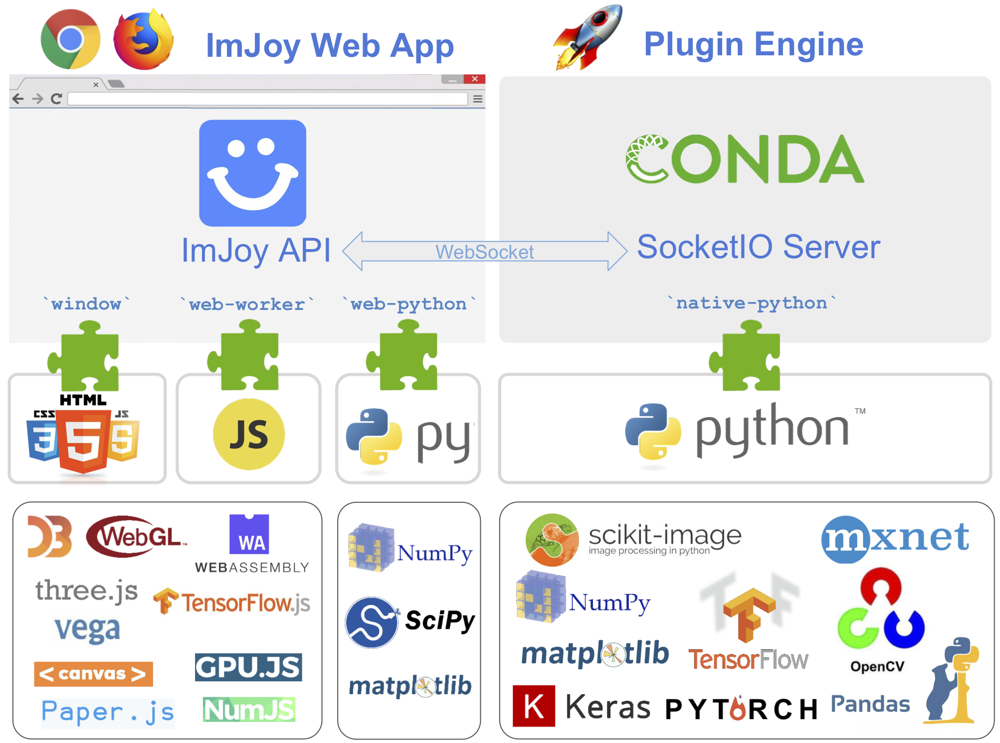

# Getting Started

Here we describe the basic concepts of ImJoy and how to get started. At the end of this document,
we provide a brief overview of key features concerning developers of either plugins or the ImJoy core.

For more details for how to use ImJoy, we refer to the section **User Manual**, where
we provide more detailed information about different aspects of ImJoy mentioned below.
For developers, we provide more information about how to develop plugins in
the section **Development**, and we provide a detailed description of the entire **ImJoy API**.

## Glossary

-   **ImJoy app** - Interface running either in the browser or as a standalone app
    allowing to control ImJoy.
-   **Plugin** - Added functionality to ImJoy to either enhance the user interface
    or perform computational tasks. Plugins developed in Python require the Plugin Engine.
-   **Plugin Engine** - Python program to execute plugins in the background for heavy
    computations.
-   **Operators [ops]** - One plugin can allow to perform tasks with a set of
    operators ("ops"). These ops can be used in a workflow or accessed from the plugin menu.
-   **Workflow** - Allows to assemble a series of ops to perform a series of processing
    steps. Ops can access the results of preceding ops in the workflow. Workflows can be saved and reused.
-   **Workspace** - Isolated work environments with a distinct set of plugins.
    Allows to perform independent calculations.

## The ImJoy interface

This interface provides all functionality needed to process data.

## ImJoy App and Plugin Engine

ImJoy can be used  directly from your browser (Chrome or Firefox)
**without any installation** [ImJoy Web App](https://imjoy.io/#/app)
or as a **standalone** [ImJoy Desktop App](https://github.com/oeway/ImJoy-App/releases).
Many plugins can be used directly, and you can already get a feeling
for how ImJoy works.

For more advanced processing, the **Python Plugin Engine** is required.
Such plugins are highlighted with a 🚀. The plugin engine is included in the ImJoy Desktop App.
After installing the [Desktop App](https://github.com/oeway/ImJoy-App/releases),
you can start the engine with the button `START PLUGINE ENGINE`.
You can then connect to the engine either from the Imjoy Web App or Desktop App.
Click the 🚀 button located on the upper-right corner.
In the displayed window, you will find instructions on how to set up the engine.

### Plugins

The entire functionality of ImJoy is provided by plugins. To install new plugins
from the [Plugin Repository](https://github.com/oeway/ImJoy-Plugins), click **+ PLUGINS**.
This will show a window with all available plugins with a short description.
A longer description can be obtained by pressing on the **...** and **Docs**.
To install a plugin, press on the cloud button. Plugins requiring the **Python Plugin Engine**
have the 🚀 symbol next to their title.

Once a plugin is installed, you can open the plugin menu, by pressing on the down
arrow next to the plugin. This will shows (if applicable) a list of
**parameters** which determine the plugin behavior. You can **execute**
the plugin by pressing on its title.

To obain more information about an installed plugin, press on the icon next to
the plugin and select **Docs**. This will show a new window with a detailed
description of how the plugin works, for instance how input data
is provided. From the same menu, you can also remove it.

### Data

ImJoy provides different ways for how data can be provided. Some plugins will
ask you via a file-dialog to specify which data you want to process. Other will
allow you to load files into the workspace (via the **+** button in the upper
left corner). To process these data, you can select the corresponding window and
then execute the plugin.

### Workflow

You can then create your own workflow by defining a sequence of processing steps.

### ImJoy and online access

The ImJoy app (web or desktop) requires by default internet access. It relies on
different small libraries that are downloaded at each launch.

You can also use the ImJoy app in an offline mode. In this case, all necessary
files have to be downloaded first. Two options exist:

1. **Desktop app**. On the start-up screen you can choose `RUN IMJOY OFFLINE`. If
  you press this button, the app will download all necessary files required
  for offline use. After the initial download, you can then use ImJoy offline.

2. **Web app**. If you prefer to use ImJoy in the browser, you can download all
  ecessary files via the plugin engine. This requires some simple steps in the
  terminal as explained [here](user_manual?id=using-the-plugin-engine-remotely)

## ImJoy for plugin developers

As mentioned above, Imjoy consists of **two main components**
</img>

1.  The **ImJoy Web App**. The app can run alone, and plugins can be developed in
    JavaScript or in Python by using [pyodide](https://github.com/iodide-project/pyodide).

2.  Complex computional tasks can be implemented in plugins, which run in the
    **Plugin Engine**. The latest release of the plugin engine is available
    together with installation  instructions on [GitHub](https://github.com/oeway/ImJoy-App/releases).
    The plugin engine will try to upgrade itself from GitHub when it starts.
    Packages are managed by `conda` and `pip` which provides access to the
    entire Python ecosystem.

The Python Plugin Engine is connected with the ImJoy Web App through websockets
and communicate with a customized remote procedure calls (RPC) based on [socket.io](https://github.com/miguelgrinberg/python-socketio).

### How to choose plugin environment
ImJoy provides a flexible framework to develop your plugins. Here we provide
some typical examples for how ImJoy can be used. Please not that these are only
some suggestions, other combinations are of course possible and be interesting
for particular applications

1. **ImJoy Web App with JavaScript or Web Python plugins**. Such a framework runs without
 any installation on different operation systems. It can provide effortless user
 experience and ideal for distributing demos. Limitations are that Web Python is (currently)
 slower than native Python and that it doesn't support the entire Python ecosystem.

2. **Desktop App**. Here you can all plugins types (JavaScript included). Further,
  you have access to the entire python ecosystem thanks to the integrated plugin engine.
  Ideal for heavy computations or when Python modules that are not available for webPY are used.
  However, the app has to be installed.

3. **Plugin engine on a remote computer**. You can then connect to the engine either
  from the web or desktop app. This allows to process data on a dedicated processing
  workstation or a cluster.
