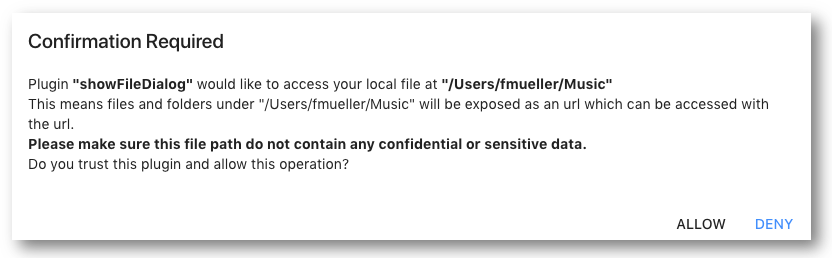

# ImJoy API

Every plugin runs in its own sandbox-like container environment (webworker or iframe for JS, process for Python) to avoid interfering other plugin and make the entire ImJoy App more secured. The interaction between plugins or with the main app is carried out through a set of API functions (`ImJoy API`). All the plugins have access to a special object called `api`, with which the plugin can, for example, show a dialog, send results to the main app, or call another plugin with paramenters and data.

To make the interaction more efficient and concurrently, we chose a modern programing pattern called ["asynchronous programming"](http://cs.brown.edu/courses/cs168/s12/handouts/async.pdf) for these API functions.

## Asynchronous programming

All ImJoy API functions are asynchronous. This means when an `ImJoy API` function
is called, ImJoy will not block the execution, instead, it will immediately return an object called [`Promise`(JS)](https://developer.mozilla.org/en-US/docs/Web/JavaScript/Reference/Global_Objects/Promise) or [`Future`(Python)](https://docs.python.org/3/library/asyncio-future.html). You can decide to wait for the actual result or set a callback function to retrieve the result. For example, if you popup a dialog to ask for user input, in many programinig languages (synchronous programing), the code execution will be blocked until the user closes the dialog. However, an asynchronous program will return the `promise` object even if the user haven't close the dialog and continue processing.

Since every API call is asynchronous and non-blocking, a given plugin can easily call multiple other plugins to perform tasks simultaneously without using thread-like techniques.

ImJoy suports two asynchronous programming styles to access these asynchronous functions
for both Python and JavaScript: `async/await` and `callback` style. A few important
considerations

* `async/await` is recommended for JavaScript and Python 3 (expect webPython, which doesn't support it yet).
* `callback` style can be used for Javascript, Python 2 and Python 3.
*  **Note** that you **cannot** use both style at the same time.
* While you can use `try catch` (JavaScript) or `try except` (Python) syntax to capture error with `async/await` style, you cannot use them to capture error if you use `callback` style.

In the following list of API functions, we provided examples in `async` style. For Python 2, you can easily convert to callback style accordingly.

For more information about Asynchronous programming, we refer to a number of
excellent ressources:

* [Introduction to Promise in JS](https://developers.google.com/web/fundamentals/primers/promises)
* [Async functions for JS](https://developers.google.com/web/fundamentals/primers/async-functions)
* [Asynchronous I/O module for Python 3+](https://docs.python.org/3/library/asyncio.html).


### `async/await` style
For Javascript and Python 3+, `async/await` style is natively supported and recommended.


Declare your function with the `async` keyword. Add `await` before the asynchronous function to wait for the result. This essentially allows synchronous style programming without the need to set callbacks. For example:

 ```javascript
 class ImJoyPlugin(){
   async setup(){
   }
   async run(my){
     try{
       result = await api.XXXXX()
       console.log(result)
     }
     catch(e){
       console.error(e)
     }
   }
 }
 ```

```python
import asyncio

class ImJoyPlugin():
    async def setup(self):
        pass

    async def run(self, my):
        try:
            result = await api.XXXXX()
            print(result)
        except Exception as e:
            print(e)
 ```

Notice that you can **only** use `wait` when you add `async` before the
definition of your function. Don't forget to `import asyncio` if you use `async/await` with Python 3.


### `callback` style
However, for Python 2 or webPython, `asyncio` is not supported, therefore you need to use `callback` style.

Call the asynchronous function and set its callback with `.then(callback_func)`.
For Javascrit plugins, a native Javascrit `Promise` will be returned ([More about Promise.](https://developer.mozilla.org/en-US/docs/Web/JavaScript/Reference/Global_Objects/Promise)). For Python plugins, it will return a simplified Python implement of promise.

Below examples for an api name `XXXXX`:

```javascript
class ImJoyPlugin(){
  setup(){
  }
  run(my){
      api.XXXXX().then(this.callback)

      // optionally, you can catch error
      const error_callback(error){
        console.error(error)
      }
      api.XXXXX().then(this.callback).catch(error_callback)
  }

  callback(result){
     console.log(result)
  }
}
```

```python
class ImJoyPlugin():
    def setup(self):
        pass

    def run(self, my):
        api.XXXXX().then(self.callback)

        # optionally, you can catch an error
        def error_callback(error):
            print(error)
        api.XXXXX().then(self.callback).catch(error_callback)

     def callback(result):
        print(result)
```


## Input arguments
When calling the API functions, most functions take an object (Javascript) or dictionaries/named arguments (Python) as its first argument.

The following function call will work both in JavaScript and Python:

```javascript
await api.XXXXX({"option1": 3, "option2": 'hi'})
```

This call will work only for Python:
```python
await api.XXXXX(option1=3, option2='hi')
```

### API functions
For each api function we provide a brief code snippet illustrating how this
function can be used. Below, you will find links **Try it yourself >>**. These will
open a full example in ImJoy, where see the function in action. The examples are
in JavaScript, but the api functions are called in similar fashion in Python.

### `api.alert(...)`
Shows an alert dialog with a message.

``` javascript
api.alert('hello world')
```
[**Try yourself >>**](https://imjoy.io/#/app?plugin=oeway/ImJoy-Demo-Plugins:alert&w=examples)

### `api.call(...)`
Call a function defined in another plugin by specifying the plugin name, the function name and the arguments. You need to make sure the argument number match the actual function defined in the plugin. For instance, to call a function called `funcX` defined in the plugin named `PluginX` with the argument `1`, you can use

``` javascript
await api.call("PluginX", "funcX", 1)
```
[**Try yourself >>**](https://imjoy.io/#/app?plugin=oeway/ImJoy-Demo-Plugins:call&w=examples)

### `api.export(...)`
Export the plugin class or an object/dict as `Plugin API`, this call is mendatory for every ImJoy plugin (typically as the last line of the plugin script). This then allows
to call plugins with the `api.run` or `api.call` function.

```javascript
api.export(new ImJoyPlugin())
```
or
``` python
api.export(ImJoyPlugin())
```

Every member of the `ImJoyPlugin` instance will be exported as `Plugin API`, which means those exported functions or variables can be called or used by the ImJoy app or another plugin.

Notice that, only functions and variables with primitive types can be exported (number, string, boolean). And if a variable or function has a name start with `_`, it means that's an internel variable or function, will not be exported.

### `api.register(...)`
Register a new operator (**op**) to perform a specific task. An op can have its own `ui` which defined with the same rule as the `ui` field in `<config>` -- `ui` can be defined as a single (long) string, an array of strings, or an array of objects for JavaScript (a list of dict for Python). See the `development` page for the examples of different `ui` definition.

```javascript
api.register({
    name: "LUT",
    ui: [{
        "apply LUT": {
            id: 'lut',
            type: 'choose',
            options: ['hot', 'rainbow'],
            placeholder: 'hot'
        }
    }]
})
```
[**Try yourself >>**](https://imjoy.io/#/app?plugin=oeway/ImJoy-Demo-Plugins:register&w=examples)


```python
api.register(name = "LUT", ui = [{
  "apply LUT": {
    "id": "lut",
    "type": "choose",
    "options": ["hot", "rainbow"],
    "placeholder": "hot"
  }
}])
```

By default, all ops of a plugin will call its `run` function defined in the plugin.
You can use `my.config.type` in the `run` function to differentiate which op was called.

Alternatively, you can define another `Plugin API` function which will be used
when the op is called with the `run` field when calling `api.register`. For example, you can add  `"run": this.hello` in a Javascript plugin or `"run": self.hello` in a Python plugin if `hello` is a member function of the plugin class.

[**Try yourself >>**](https://imjoy.io/#/app?plugin=oeway/ImJoy-Demo-Plugins:register&w=examples)  Compare how the ops for favorite number and animal are imlemented.

**Note:** the function must be a member of the plugin class or being exported (with `api.export`) as a `Plugin API` function. This is because a arbitrary function transfered by ImJoy will be treated as `callback` function, thus only allowed to run once.

If you want to run a function whenever any option is changed, you can pass a `update` function. Similar to `run`, you need to pass a function from the member of the plugin class. Here is an example defining `run` and `update` in Python:

```python
class ImJoyPlugin():
  def apply_lut(self, my):
      ...
  def lut_updated(self, my):
      ...
  def setup(self):
      ...
      api.register(name="LUT",
                   ui="apply LUT {id:'lut', type:'choose', options:['hot', 'rainbow'], placeholder: 'hot'}",
                   run=self.apply_lut,
                   update=self.lut_updated)
      ...
```

If you want to change your interface dynamically, you can run `api.register`
multiple times to overwrite the previous version.

`api.register` can also be used to overwrite the default ui string of the plugin
defined in `<config>`, just set the plugin name as the op name (or without setting a name).


### `api.run(...)`
Run another plugin by specifying its name.

``` python
await api.run("Python Demo Plugin")
```
[**Try yourself >>**](https://imjoy.io/#/app?plugin=oeway/ImJoy-Demo-Plugins:run&w=examples)

You can also pass [`my`](https://imjoy.io/docs/#/development?id=plugin-during-runtime)
to this plugin to transfer data.

``` python
await api.run("Python Demo Plugin", my)
```

You can also run multiple plugins concurrently (Python example):

```python
p1 = api.run("name of plugin 1")
p2 = api.run("name of plugin 2")

result1 = await p1
result2 = await p2
```
The above code will start two plugins almost simutaneously, then wait for the result one after another.

Or even better, you can await two tasks simutaneously with `asyncio.gather` by using the following code:

```python
p1 = api.run("name of plugin 1")
p2 = api.run("name of plugin 2")
result1, result2 = await asyncio.gather(p1, p2)
```

Similary for Javascript, you can do:
```javascript
const p1 = api.run("name of plugin 1")
const p2 = api.run("name of plugin 2")
const [result1, result2] = [await p1, await p2]
```

This is different from the following sequential version, where plugin 2 can only start after plugin 1 is finished:
```python
result1 = await api.run("name of plugin 1")
result2 = await api.run("name of plugin 2")
```

### `api.createWindow(...)`
Creates a new window and adds it to the workspace.

`async/await` style for Javascript and Python 3+

```javascript
// Remember to add async to the function before using await
const windowId = await api.createWindow({name: 'new window', type: 'Image Window', w:7, h:7, data: {image: ...}, config: {}})
console.log(windowId)
```

```python
# Remember to add async to the function before using await
windowId = await api.createWindow(name='new window', type='Image Window', w=7, h=7, data={image: ...}, config={})
print(windowId)
```

`callback` style for Python 2 (also works for Javascript and Python 3)
```python
def window_callback(windowId):
    print(windowId)
api.createWindow({name: 'new window', type: 'Image Window', w:7, h:7, data: {image: ...}, config: {}}).then(window_callback)
```

If you do not want the window to load immediately, you can add `click2load: true` and the window will ask for an extra click to load the content.

Once an window is created, it will return a window ID, which can be used for updating the window with `api.updateWindow`.

### `api.updateWindow(...)`
update an existing window, an window ID (produced by `api.createWindow`) should be passed in order to perform the update, example:

```javascript
api.updateWindow({id: windowId, data: {image: ...}})
```

```python
# pass as a dictionary
api.updateWindow({'id': windowId, 'data': {'image': ...}})

# or named arguments
api.updateWindow(id=windowId, data={'image': ...})
```

The second parameter is an object contains fields which the plugin wants to update, it will be passed as `my.data` to the `run` function of the target window plugin. If the target window is a internally supported window (e.g. `imjoy/image`), then it will just replace the content (since there is not `run` function).

In case of the user closed the previous window which the `windowId` refer to, it will throw an error. However, you can also pass `name` and `type` as you will do with `api.createWindow`, if these two fields exists, it will call `api.createWindow` if the windowId do not exists or the window has been closed by the user. If `api.createWindow` is called, the `windowId` needs to be updated, therefore, you need to save the returned `windowId`.

Here is the code for this:
```javascript
windowId = await api.updateWindow({id: windowId, name: 'new window', type: 'Image Window', w:7, h:7, data: {image: ...}})
```

```python
# pass as a dictionary
windowId = await api.updateWindow({'id': windowId, name: 'new window', type: 'Image Window', w:7, h:7, 'data': {'image': ...}})

# or named arguments
windowId = await api.updateWindow(id=windowId, name='new window', type='Image Window', w=7, h=7, data={'image': ...})

# callback style
def cb(wid):
    windowId = wid
api.updateWindow({'id': windowId, name: 'new window', type: 'Image Window', w:7, h:7, 'data': {'image': ...}}).then(cb)
```

### `api.showDialog(...)`
Show a dialog with customized GUI. The answer is stored in the returned object,
and can be retrieved with the specified `id`. To consider the case when the user
presses `cancel`, you can use the `try catch` (JavaScript) or `try except` (Python)
syntax.

```javascript
const result = await api.showDialog({
   "name": "This is a dialog",
   "ui": "Hey, please select a value for sigma: {id:'sigma', type:'choose', options:['1', '3'], placeholder: '1'}.",
})
```
[**Try yourself >>**](https://imjoy.io/#/app?plugin=oeway/ImJoy-Demo-Plugins:showDialog&w=examples)


### `api.showProgress(...)`
Updates the progress bar on the Imjoy GUI. Allowed input value range from 0 to 100.

``` javascript
api.showProgress(85)
```
[**Try yourself >>**](https://imjoy.io/#/app?plugin=oeway/ImJoy-Demo-Plugins:showProgress&w=examples)


### `api.showSnackbar(...)`
Shows a quick message with a snackbar and disappear in a few seconds.

``` javascript
api.showSnackbar('processing...', 5)
```

[**Try yourself >>**](https://imjoy.io/#/app?plugin=oeway/ImJoy-Demo-Plugins:showSnackbar&w=examples)


### `api.showStatus(...)`
Updates the status text on the Imjoy GUI.

``` javascript
api.showStatus('processing...')
```

[**Try yourself >>**](https://imjoy.io/#/app?plugin=oeway/ImJoy-Demo-Plugins:showStatus&w=examples)


### `api.showPluginProgress(...)`
update the progress bar of the current plugin (in the plugin menu).

```javascript
api.showPluginProgress(85)
```

### `api.showPluginStatus(...)`
Updates the status text of the current plugin (in the plugin menu).

``` javascript
api.showPluginStatus('processing...')
```


### `api.showFileDialog(...)`
Shows a file dialog to select files or directories. It accept the following options:

 * `type` the mode of file dialog: `file` (default) to select one or multiple files; `directory` to select one or multiple directories. For Python plugins, if you don't specify the type, both file or directory can be selected.
 * `title` the title of the dialog.
 * `root` the initial path for the dialog to show. Note: for Python plugins on Windows, you may want to define the path string as raw string using `r"xxxxxx"` syntax, we have encountered unrecognized path issue with normal strings.
 * `mode` two modes are supported. By default, the user can select a single or multiple file (with the `shift` key pressed). If you want to force the dialog to return multiple files or directories in an array or list, set `mode` to `"multiple"`, or you can force it to return only a single file or directory by setting `mode` to `"single"`, if you want to support both, you can explicitly set `mode` to `"single|multiple"` or keep the default setting.
 * `uri_type` choose the type for return between `"url"` or `"path"`. The default value for JavaScript plugins is `"url"` and for Python plugins is `"path"`.

Since the file handling is different in the browser environment and Python, this api have different behavior when called from different types of plugin. In JavaScript and Python, an Imjoy file dialog will be displayed, it will only return a promise from which  you can get the file path string.

For instance, you can get this error me

</img>

```javascript
const file_path = await api.showFileDialog()
console.log(file_path)
```
[**Try yourself >>**](https://imjoy.io/#/app?plugin=oeway/ImJoy-Demo-Plugins:showFileDialog&w=examples)

```python
path = await api.showFileDialog()
print(path)
```

### `api.getFileUrl(...)`
Generates an url to access a local file or directory path. For example: `api.getFileUrl('~/data/output.png')`, will return something like `http://127.0.0.1:8080/file/1ba89354-ae98-457c-a53b-39a4bdd14941?name=output.png`.

When this function is called, a confirmation dialog will be displayed to obtain the user's permission. This means a JavaScript plugin cannot access the user's file system without notifying the user.

There are two optional parameters `password` and `headers`:
 * `password`: You can specify a password to access the file or folder. For example: `api.getFileUrl('~/data/output.png', password='SECRET_PASSWORD')`.

 * `headers`: By default, the generated url will be served with the header `Content-disposition: inline; filename="XXXXXXXXX.XXX"` for rendering in the browser. If you want to generate a directly downloadable link, you can pass customized `headers`. For example: `headers={'Content-disposition': 'attachment; filename="XXXXXXXXX.XXX"'}` will give you a direct download link. In order to correctly render the file, you may need to pass a `Content-Type` like this:  `headers={'Content-disposition': 'inline; filename="XXXXXXXXX.XXX"', 'Content-Type': 'image/png'}`. If no header is specified, it will use the standard Python library [mimetypes](https://docs.python.org/3/library/mimetypes.html) to guess a MIME type from the file name, if `mimetypes` failed to guess one, the fallback mime type will be `application/octet-stream`.

### `api.getFilePath(...)`
Converts an url generated by `api.getFileUrl` into an absolute file path on the file system, which can be further accessed by a Python Plugin.

### `api.setConfig(...)`
Each plugin can store its configurations with `api.setConfig`. With this settings can be stored
and reloaded automatically. For example store a simple number `api.setConfig('sigma', 928)`. You can store numbers ands strings but neither objects/arrays (JS) nor dict/list (Python). Please note that numbers are stored as strings.

If you want to remove a certain config, just set its value to `null`(JavaScript) or `None`(Python).

**Note1** when choosing the config key, if you use a key name starts with `_`, please avoid conflicting with the fields defined in the `<config>` block.
**Note2** this is designed for storing small amounts of data, not large object.
Current implementation uses `localStorage` to store settings. Depends on different browsers, most of them can only allow 5M data storage shared by all the plugins and ImJoy app itself.

### `api.getConfig(...)`
Retrieves configurations set by `api.setConfig(...)`. For example in JavaScript you can use `const sigma = await api.getConfig('sigma')` to access previously stored settings named `sigma`.

Alternatively, you can use `Promise` to access it: ` api.getConfig('sigma').then((sigma)=>{ console.log(sigma) })`.

Similarly, for Python, you will need to use callback function to access the result:
```python
sigma = await api.getConfig('sigma')
print(sigma)
```

**Note1** that numbers are converted to strings when saved with `api.setConfig`. They have to be converted back to numbers before using them (in JavaScript use `parseInt()` or `parseFloat()`, in Python `int()` or `float()`).

**Note2** you can also access the fields defined in the `<config>` block by add `_` to the field name, for example, if you want to read the plugin name `defined` in the `<config>` block, you can use `plugin_name = await api.getConfig('_name')`.

### `api.getAttachment(...)`
You can store any text data such as base64 encoded images, code and json in the `<attachment>` block, for example if you have the following attachment block in the plugin file:

``` html
<attachment name="att_name">
</attachment>
```

To get the content in JavaScript or Python, you can use `api.getAttachment("att_name")`.

```JavaScript
const content = await api.getAttachment("att_name")
```

```python
content = await api.getAttachment("att_name").then(callback)
```

### `api.utils.XXXX(...)`
For Javascript plugins, currently supported functions are:
`api.utils.$forceUpdate` for force refreshing the GUI.
`api.utils.openUrl` for open an url in a new browser tab.

For Python Plugins, currently supported functions are:
`api.utils.kill` for kill a `subprocess` in python.

`api.utils.ndarray` for wrapping ndarray according to ImJoy ndarray format.

### `api.TAG` constant
The current tag choosen by the user during installation.

### `api.WORKSPACE` constant
Name of the current workspace.
