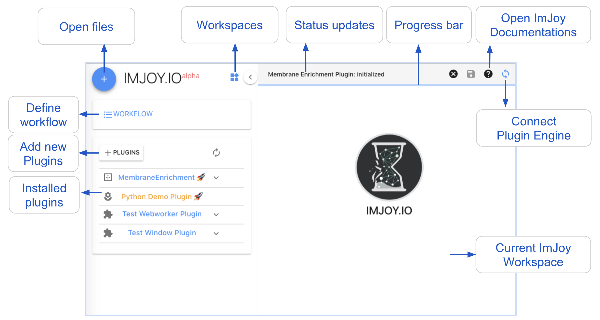
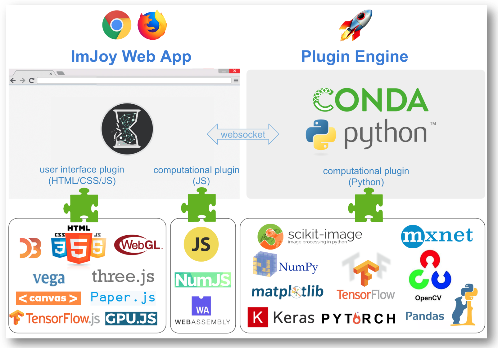

# Getting Started

Here we describe the basic concepts of ImJoy and how to get started. At the end of this document, we provide a brief overview of key features corcerning developers of plugins or the ImJoy core.

For more details for how to use ImJoy, we refer to the section **User Manual**, where
we provide more detailed information about different aspects of ImJoy. For developers,
we provide more information about how to develop plugins in the section **Development**, and we provide a detailed description of the entire **ImJoy API**.

## Glossary

-   **ImJoy app** - Interface running either in the browser or as a standalone app
    allowing to control ImJoy.
-   **Plugin** - Added functionality to ImJoy to either enhance the user interface
    or perform computational tasks. Plugins developed in Python require the Plugin Engine.
-   **Plugin Engine** - Python program to execute plugins in the background for heavy
    computations.
-   **Operator [Ops]** - One plugin can allow to perform tasks with a set of
    operators ("ops"). These ops can be used in a workflow or accessed from the plugin menu.
-   **Workflow** - Allows to assemble a series of ops to perform a series of processing
    steps. Ops can access the results of preceding ops in the workflow. Workflows can be saved and reused.
-   **Workspace** - Isolated work environments with a distinct set of plugins.
    Allows to perform independent calculations.

## ImJoy App and Plugin Engine

ImJoy can be used  directly from your browser (Chrome or Firefox) **without any installation** [ImJoy web app](https://imjoy.io/#/app) or as a **standalone** [desktop app](<add link>). Many plugins can be used directly, and you can already get a feeling
for ImJoy works.

For some more advanced processing, the **Python Plugin Engine**  is required. Such
plugins are highlighted with a 🚀. If you use the webApp then you have to install
the plugin engine. Click the 🚀 button located on the upper-right corner. In the displayed window, you will find instructions on how to set up the engine. When you use
the desktopApp, the plugin is alread included!

## The ImJoy interface

This interface provides all functionality needed to process data.

</img>

### Plugins

The entire functionality of ImJoy is provided by plugins. To install new plugins from the [Plugin Repository](https://github.com/oeway/ImJoy-Plugins), click the **+ PLUGINS**. This will show a window with all available plugins with a short description.
A longer description can be obtained by pressing on the **...** and **Docs**.
To install a plugin, press on the cloud button. Plugins requiring the **Python Plugin Engine** have the 🚀 symbol next to their title.

Once a plugin is installed, you can open the plugin menu, by pressing on the down
arrow next to the plugin. This will shows (if applicable) a list of
**parameters** which determine the behavior of the plugin. You can **execute**
the plugin by pressing on its title.

To obain more information about an installed plugin, press on the icon next to
the plugin and select **Docs**. This will show a new window with a detailed
description of how the plugin works, for instance how input data
is provided. From the same menu, you can also remove it.

### Data

ImJoy provides different ways for how data can be provided. Some plugins will
ask you via a file-dialog to specify which data you want to process. Other will
allow you to load files into the workspace (via the **+** button in the upper
left corner). To process these data, you can select the corresponding window and
then execute the plugin.

### Workflow

You can then create your own workflow by defining a sequence of processing steps.
Such workflows can be saved and then shared with other ImJoy users (**To be done**).

## ImJoy for plugin developers

As mentioned above, Imjoy consists of **two main components**

1.  The **ImJoy app**. The app can run alone, and plugins can be developed in
    JavaScript or in Python by using [pyodide](https://github.com/iodide-project/pyodide).
2.  Complex computional tasks can be implemented in plugins, which run in the
    **Plugin Engine**. The latest release of the plugin engine is available
    together with installation  instructions on [GitHub](https://github.com/oeway/ImJoy-Engine/releases). The plugin engine will try to upgrade itself from Github when it starts. 
    Packages are managed by `conda` and `pip` which provides thusaccess to the
    entire Python ecosystem.

The Python Plugin Engine is connected with the ImJoy Web App through websockets
and communicate with a customized remote procedure calls (RPC) based on `socket.io`.

</img>

## ImJoy for core developers

**ADD**
