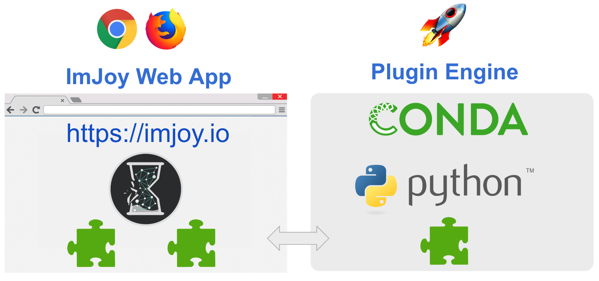

# Getting Started

Here we describe the basic concepts of ImJoy and how to get started. More detailed
information about ImJoy architecture, existing plugins, and how to develop your own
plugins can be found in dedicated sections.

##  Glossary
* **Web app** - Interface running in the browser allowing to control ImJoy   
* **Plugin** - Added functionality to ImJoy to either enhance the user interface or perform computational tasks. Plugins developed in Python require the Plugin Engine.
* **Plugin Engine** - Python program to execute plugins in the background for heavy computations
* **Operator [Ops]** - One plugin can allow to perform tasks with a set of operators ("ops"). These ops can be used in a workflow or accessed from the plugin menu.
* **Workflow** - Allows to assemble a series of ops to perform a series of processing steps. Ops can access the results of preceding ops in the workflow. Workflows can be saved and reused.
* **Workspace** - Isolated work environments with a distinct set of plugins. Allow to perform independent calculations. 

##  Two flavors of ImJoy: Web App and Plugin Engine

</img>

ImJoy can be used  directly from your browser (Chrome or Firefox) **without any installation**: [ImJoy web app](https://imjoy.io/#/app). Many plugins can be
directly used, and you can get a good overview of how ImJoy looks like.

For some more advanced processing, the **Python Plugin Engine**  is required.
We handles the installation of the necessary tools for you, go to the [ImJoy web app](https://imjoy.io/#/app), and click the 🚀 button located on the upper-right corner.
In the displayed window, you will find instructions on how to set up the engine.

##  The ImJoy interface
This interface provides all functionality needed to process your data. We will
describe how to ...
1. use plugins,
2. get your data into ImJoy,
3. define workflows.

</img>

### Plugins
The entire functionality of ImJoy is provided by plugins. To install new plugins from the [Plugin Repository](https://github.com/oeway/ImJoy-Plugins), click the **+ PLUGINS**. This will show a window with all available plugins with a short description. A longer description can be
obtained by pressing on the **...** and **Docs**. To install a plugin, press on cloud button.

Plugins requiring the **Python Plugin Engine** have the 🚀 symbol next to their title.

To obain more information about an installed plugin, press on the icon next to
the plugin and select **Docs**. This will show a new window with a detailed
description of how the plugin works, for instance how input data
is provided. From the same pulldown menu, you can also remove it.

Pressing on the down arrow next to the plugin shows (if applicable) a list of
**parameters** which determine the behavior of the plugin. You can **execute**
the plugin by pressing on its title.

### Data
ImJoy provides different ways for how data can be provided. Some plugins will
ask you via a file-dialog to specify which data you want to process. Other will
allow you to load files into the workspace (via the **+** button in the upper
left corner). To process these data, you can select the corresponding window and
then execute the plugin.

### Workflow
You can then create your own workflow by defining a sequence of processing steps.
Such workflows can be saved and then shared with other ImJoy users (**To be done**).
