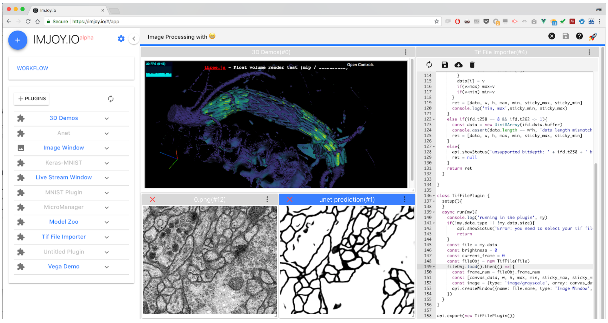
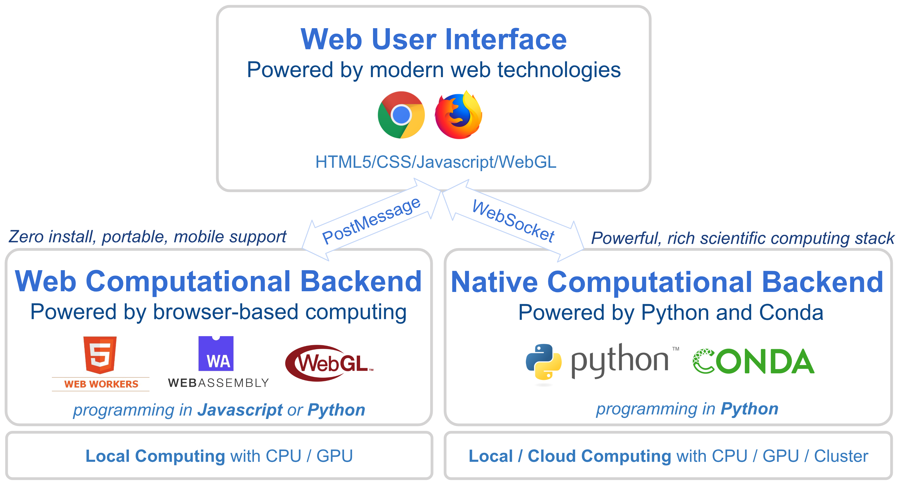

# ImJoy

ImJoy is a flexible image processing framework for the deployment of complex
computational tasks in a robust, secure and easy-to-use environment.
The entire functionality is provided by **plugins**. These plugins can be
assembled into **workflows** in a modern graphical user-interface.
Plugins can be grouped and installed into isolated workspaces avoiding
overcrowded plugin menus. This design makes ImJoy intuitive to work with
for end users. While ImJoy was developed with image processing in mind, it can
be use to deploy any kind of data processing task.

<!--- **[TODO] Add a link for a nice demo app to showcast ImJoy!** -->

</img>

## ImJoy architecture
By design, ImJoy itself provides very minimal task specific functionality, it
provides a flexible plugin interface to support plugins to extend the user
interface and perform computational tasks. Plugins can be designed to perform
simple tasks such as reading tif file, or more complex tasks such as training
a deep learning model for image segmentation.

</img>

Imjoy consists of **three parts**, each part can be extended with plugins:

1. the **Web User Interface**. ImJoy is a web application, it means that using ImJoy is as easy as opening a web page from [ImJoy.io](https://imjoy.io/#/app). With ubiquitousness of the web, ImJoy provides unified user experience with browsers running on different operating systems, including mobile devices. The user can install plugins, and use them from the web interface. Besides a easy-to-use minimal interface, plugins can create their own window to create rich and interactive web interface by making use of the full power of the entire HTML/CSS/JS frameworks. For example, with [D3.js](https://d3js.org/) or [Three.js](https://threejs.org/), one can easily provide powerful interactive charts or 3D visualization plugins. For developers, the web interface is also used for writing and testing code. A stand-alone desktop application (desktopApp) is also provided.

1. the **Web Computational Backend**. Computational tasks can be execution in web browsers directly. Browsers nowadays are highly optimized such that JavaScript engines such as Google Chrome V8 and Firefox Quantum can be used to perform computational tasks. The performance of JavaScript Engines are close or even better than native languages such as Java and Python ([Benchmarks](https://benchmarksgame-team.pages.debian.net/benchmarksgame/faster/node-python3.html)). With HTML5/WebGL, browser can access to GPUs, allowing transparent GPU computing with libraries such as [Tensorflow.js](https://js.tensorflow.org/). With a new web standard called [WebAssembly](https://webassembly.org/), software/libraries written in high-level languages like C/C++/Rust can be ported to run in the browser. ImJoy uses ["Pyodide"](https://github.com/iodide-project/pyodide) to run Python plugins directly in the browser. The advantage of using the web computational backend is it requires almost zero setup and can run on mobile devices. Importantly, browser provides a unified, secured and sandboxed environment with maximized security and stability.

1. the **Native Computational Backend**. This is supported with the installation of an additional Python module called ["ImJoy Plugin Engine"](https://github.com/oeway/ImJoy-Engine). This allows to access the entire Python ecosystem which covers most of the scientific computing applications. With [Conda](https://conda.io), ImJoy plugin engine handles the requirements of plugins automatically and provide isolate processes and virtual environments for different Python plugins. It provides maximum flexibility and has full access to the file system, GPU and other local or remote resources. The plugin engine can be launched either on the local machine, or remotely on a cloud server or a cluster to perform computationally intensive tasks, e.g. with institutional computing cluster, Amazon Cloud, or Google Compute.

## Key features

-   Minimal and flexible design
-   Rich and interactive user interface powered by web technologies
-   Powerful computational backend powered by the Python ecosystem
-   Easy-to-use workflow composition
-   Isolated workspaces for grouping plugins
-   Extendable plugin interface supports Python and JavaScript
-   WebAssembly powered web Python plugins
-   Concurrent plugin execution through asynchronous programming
-   Self-contained plugin development
-   Easy plugin deployment and sharing through GitHub or Gist

## Source code

Currently, ImJoy source code consists of three repositories:

-   [web application](https://github.com/oeway/ImJoy/)
-   [plugin engine](https://github.com/oeway/ImJoy-Engine)
-   [plugin repository](https://github.com/oeway/ImJoy-Plugins)

## Acknowledgements

This is a non-exhaustive list of the open-source tools and libraries we used in ImJoy:

-   [Joy.js](https://github.com/ncase/joy) (This is where the name `ImJoy` comes from!)
-   [Jailed](https://github.com/asvd/jailed) (This helps ImJoy to isolate plugins)
-   [Vue.js](https://vuejs.org/) (The main ImJoy App is written in Vue.js)
-   [vue-grid-layout](https://github.com/jbaysolutions/vue-grid-layout) (For window management)
-   [python-socketio](https://github.com/miguelgrinberg/python-socketio) (This how the plugin engine talk with the ImJoy app)
-   [pyodide](https://github.com/iodide-project/pyodide) (Enables web python mode with WebAssembly)
-   [conda](https://conda.io/) (The plugin engine uses Conda for managing virtual env. and pacakges)

We thank all the authors for offering these excellent work to the open-source community.

## License

[MIT License](https://github.com/oeway/ImJoy/blob/master/LICENSE)
